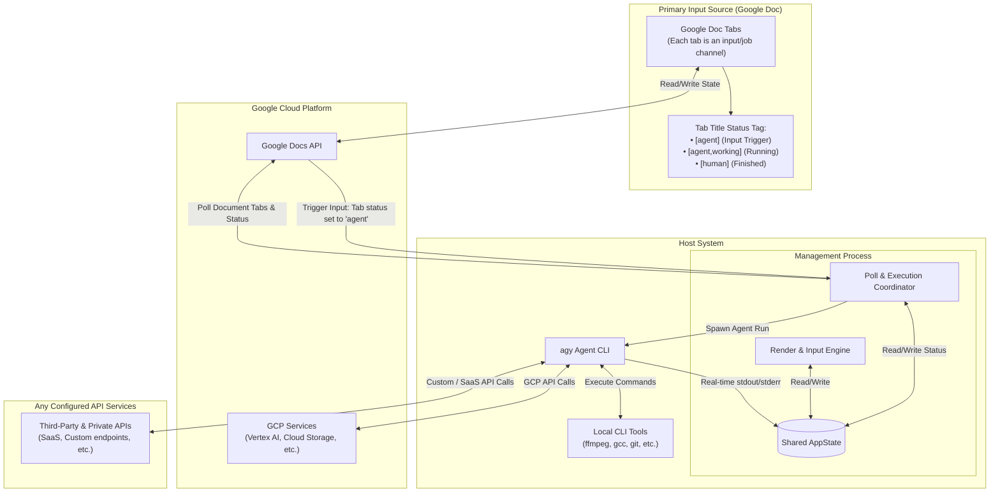

# Google Docs Agent Orchestrator TUI (Rust Edition)

A high-performance, concurrent terminal user interface (TUI) built in Rust to orchestrate, monitor, and stream background Gemini-powered Google Doc agents running via the `agy` CLI tool.

## Key Features
* **Multithreaded Concurrent Execution**: Avoids UI blocking by isolating user input, Google Docs API polling, process spawning, and stdout/stderr stream capturing into distinct threads.
* **Pure Standard Library**: Built with exactly **zero external dependencies** (`Cargo.toml` remains dependency-free) for lightning-fast compilation, portability, and 100% offline-ready operations on any standard host platform.
* **Rich Layout**: Native split-column view (32-column left navigation, 52-column right information/logs card).
* **Interactive SGR Mouse Support**: Fully interactive keyboard navigation fallback with real-time mouse-click detection. Clicking navigation items or table rows immediately updates view contexts.
* **Hierarchical Tab Extraction**: Auto-traverses and retrieves deep nested Google Doc sub-tabs recursively using a highly optimized JSON property extraction scanner.

---

## System Input Source: Google Doc Tabs

This system is entirely input-driven, where **individual Google Doc Tabs serve as the primary system inputs**. 

1. **The Google Doc Tab as Input**: Each tab within the target Google Doc functions as an independent job channel and input container. The content inside that tab is what the background Gemini-powered agent reads and processes.
2. **Tab Title Triggers (State Transition)**: The orchestrator polls the Google Doc API to watch for specific status tags in the tab titles. The state of the input is managed directly through these title updates:
   * **`[agent]` (System Input / Ready to Run)**: Appending `[agent]` to a tab's title acts as the system input, notifying the orchestrator that a new job is ready.
   * **`[agent,working]` (Active Run State)**: On detecting the input trigger, the TUI renames the tab to include `[agent,working]` on the Google Docs API and spawns a background `agy` process to execute the job.
   * **`[human]` (Completed / Returned to User)**: After successfully reading, running, and updating the tab's contents, the agent renames the tab title to `[human]`, indicating the job is complete and ready for human review.

---

## Architecture Diagram

The diagram below details the simplified architecture, state synchronization, and execution boundaries, highlighting the **Google Doc Tabs** as the primary system input:



---

## Execution Thread Breakdown

1. **Main Render Thread**: Triggers drawing loops, parses SGR terminal coordinate mouse packets, coordinates navigation selections, and writes explicit Carriage Returns (`\r\n`) to support raw terminal modes without layout distortion.
2. **Stdin Input Thread**: Non-blocking input worker that reads bytes from standard input and channels them to the Main Render Thread via an asynchronous `std::sync::mpsc::channel`.
3. **Background Poll Loop Thread**: Wakes up every 5 seconds to query the local `gcloud` CLI for fresh credentials and fetch the hierarchical document structure via `curl`. If a tab is found in `READY` status, renames the tab to `WORKING` and triggers a background agent thread.
4. **Background agy Task Thread**: Manages the child lifecycle of the `agy` process, spawning dedicated concurrent reader threads for `stdout` and `stderr` streams to aggregate terminal outputs in real-time.

---

## Getting Started

1. **Launch the TUI**:
   ```bash
   ./start_tui.sh
   ```
2. **Controls**:
   * **Mouse**: Click on options on the left-hand menu, or on any tab listed in the `Document Tabs Status` table to view real-time logs.
   * **Keyboard**: Navigate using arrow keys (or `w`/`s`, `j`/`k`), choose using `[Enter]` or `[Space]`.
   * **Exit**: Press `[q]` or `[Ctrl+C]`.
